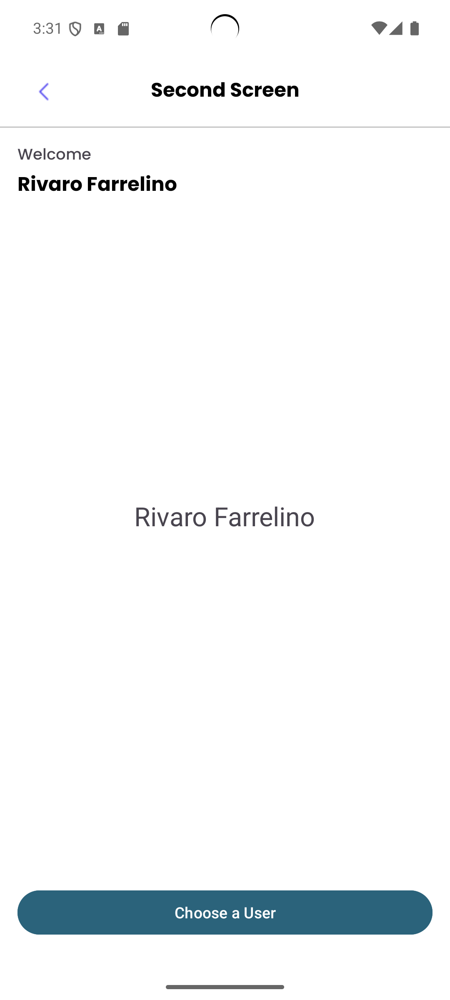
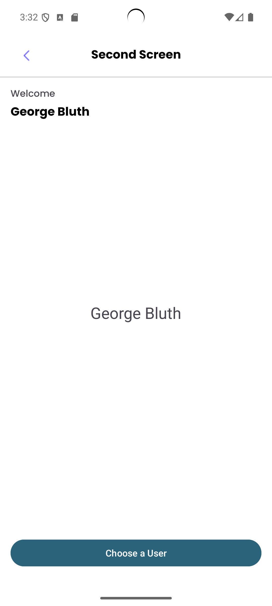

# AndroidPalindromeApp
This is a simple Android application built using Kotlin. It checks if a given sentence is a palindrome and allows users to navigate between screens.
This Repository is used for the internship test at Suitmedia as a Mobile Developer

## Features
- Palindrome checker
- User list with pagination
- Pull to refresh

## How to Run
1. Clone the repository.
2. Open it in Android Studio.
3. Sync Gradle and run the application.

## First Screen

if palindrome

if not palindrome

## Second Screen

## Third Screen

then on the second screen it will change

